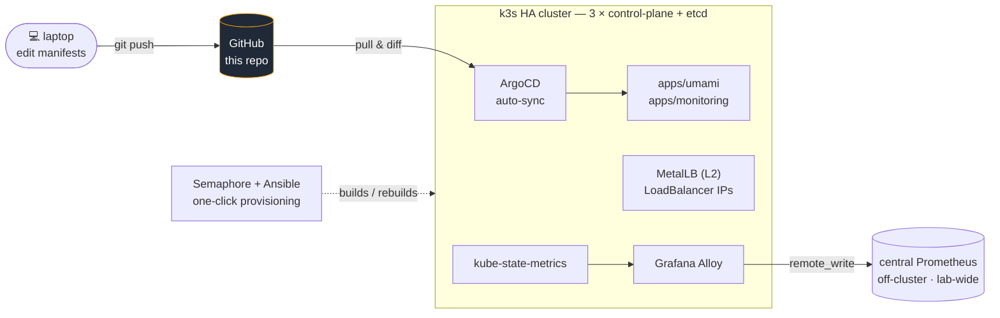

# homelab-k8s

GitOps manifests for my homelab Kubernetes cluster — a **3-node HA k3s cluster**
(embedded etcd) reconciled by **ArgoCD**. `git push` to this repo is the only
deployment mechanism: ArgoCD watches it and syncs the cluster to whatever is
committed here.

> **Disposable by design.** The cluster itself is provisioned by an idempotent
> Ansible playbook triggered from a Semaphore UI button — three cloud-init
> Debian VMs, k3s HA bootstrap, MetalLB, ArgoCD. Breaking it costs nothing:
> one click rebuilds it, then ArgoCD re-converges everything from this repo.



## The cluster

| | |
|---|---|
| Distribution | **k3s v1.35** — 3 servers, all `control-plane,etcd` → survives the loss of one node |
| Nodes | 3 × Debian 12 VMs cloned from a cloud-init template (Proxmox) |
| Load balancing | **MetalLB** in L2 mode (k3s `servicelb` disabled to avoid the conflict) |
| Ingress | Traefik (bundled with k3s) |
| Footprint | ~5 GB real RAM for all three nodes — memory ballooning + KSM on the host |
| Provisioning | Ansible playbook run from **Semaphore** — idempotent, one button, no secret stored (the join token is read from the first node at run time) |

## GitOps model

- **ArgoCD auto-syncs this repo** — no `kubectl apply` for app changes, ever.
  The git history *is* the deployment log.
- **Zero secrets in git.** Kubernetes `Secret` objects are created out-of-band
  on the cluster; manifests only reference them.
- App manifests live under `apps/<name>/`, one directory per application.

## What runs on it

| App | Manifests | Notes |
|-----|-----------|-------|
| **Umami** | [`apps/umami/`](apps/umami) | Privacy-friendly analytics for my public websites — Umami + its PostgreSQL, exposed through a MetalLB `LoadBalancer` |
| **Monitoring** | [`apps/monitoring/`](apps/monitoring) | `kube-state-metrics` + **Grafana Alloy** shipping cluster metrics via `remote_write` to the lab's **central Prometheus** (off-cluster) |

The monitoring choice is deliberate: the cluster is RAM-constrained, so it does
**not** run its own Prometheus/Grafana. A lightweight Alloy agent federates
everything into the homelab's existing observability stack — one Grafana for
the whole lab, cluster included.

## Ops notes (scar tissue)

Real issues hit and fixed here, kept for the next person who hits them:

- **ArgoCD must be installed with `kubectl apply --server-side`** — the
  `applicationsets.argoproj.io` CRD blows past the 256 KB
  `last-applied-configuration` annotation limit in client-side apply.
- **MetalLB requires disabling k3s's bundled `servicelb`** (klipper), otherwise
  both fight over `LoadBalancer` services.
- **Grafana Alloy OOM** — 256 Mi limits put it in an OOMKilled crashloop under
  real WAL load; it needed 1 Gi (see commit history). Also switched TLS from
  `insecure_skip_verify` to a proper `ca_file` + `server_name` pair for the
  internal CA.

## Why this cluster exists

Two reasons, both honest:

1. **Learn the industry-standard stack for real** — k8s + GitOps, on real
   hardware, with real failure modes (see above), not a managed sandbox.
2. **Rehearse the migration path off Coolify.** The rest of the lab deploys
   apps with Coolify (Docker). Its k8s-world equivalent is ArgoCD — once an
   app has proven itself here, the Coolify worker can eventually retire.

## Repo layout

```
apps/
├── monitoring/     ← kube-state-metrics + Grafana Alloy (remote_write)
└── umami/          ← Umami + PostgreSQL
```

## Roadmap

- **App-of-apps** — bootstrap all ArgoCD `Application` objects from this repo
  instead of registering them by hand.
- **Sealed Secrets** (or SOPS) — get secrets into git safely, kill the
  out-of-band `kubectl` step.
- Proper internal HTTPS hostname for ArgoCD behind the lab reverse proxy.
- Migrate the first real app from the Coolify worker.

---

Part of my homelab — full architecture (network segmentation, Proxmox nodes,
backup strategy) documented in [`ibhugeloo/homelab`](https://github.com/ibhugeloo/homelab).
